# KYXStart Prefill and KYP Solution Overview

## Table of Contents

- [Solution Overview](#solution-overview)
- [Key Screens](#key-screens)
- [Live Demo](#live-demo)
- [PingOne Configuration Requirements](#pingone-configuration-requirements)
- [Solution Customization](#solution-customization)
- [DaVinci Flow Exports](#davinci-flow-exports)

## Solution Overview

This proof of concept showcases a simulated account management and money transfer experience built with DaVinci and KYXStart. It is intended for demonstration purposes only and should not be considered a production-ready financial services solution.

The flow supports MFA-based sign-on, account recovery, and streamlined user registration using KYXStart Prefill. After authentication, users can add and manage their own financial accounts, including bank accounts and credit cards, and can also create and manage payee accounts. As part of the demo experience, users can also update or remove existing accounts.

Depending on how the flow is configured, users may also be prompted during their first sign-on to complete a government document verification step. This optional check is described further in the flow configuration.

When a user adds a new bank account or credit card, the flow uses KYXStart to assess the account’s verification status. Verification results are returned as **pass**, **partial**, or **fail**. Only accounts with a status of **pass** or **partial** can be added. The user is also shown the verification result along with human-readable reasons that explain the outcome.

Once the user has added eligible financial accounts and at least one payee account, they can initiate a simulated transfer of funds. Before the transfer is completed, the flow can optionally perform a pre-verification step through KYXStart to reverify the source account if its last verification is older than a configured number of days. Additional details are provided in the flow configuration.

Completed transfers can be viewed within the experience, along with the user and payee account details captured for the transaction.

## Key Screens

The following screenshots highlight the primary states and flows included in the KYXStart DaVinci demo.

<table>
  <tr>
    <td align="center" width="33%">
      <a href="./images/01-signon.png">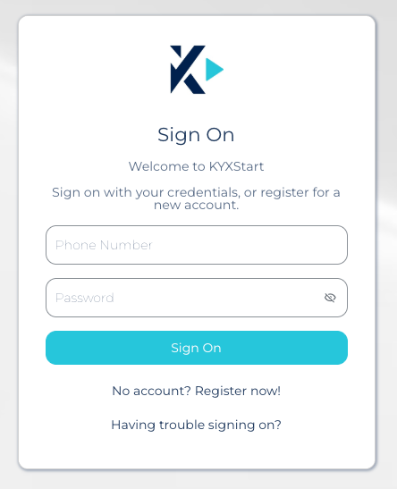</a> 
      <b>Sign On</b>
    </td>
    <td align="center" width="33%">
      <a href="./images/02-registration.png">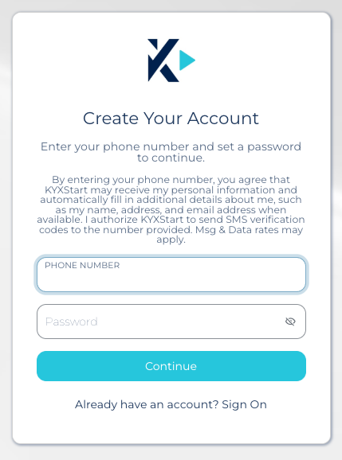</a> 
      <b>User Registration</b>
    </td>
    <td align="center" width="33%">
      <a href="./images/03-test-user-selection.png">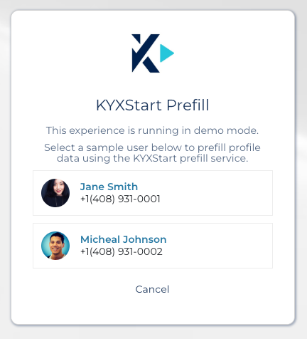</a> 
      <b>Test User Selection</b>
    </td>
  </tr>
  <tr>
    <td align="center" width="33%">
      <a href="./images/04-kyxstart-registration-prefill.png">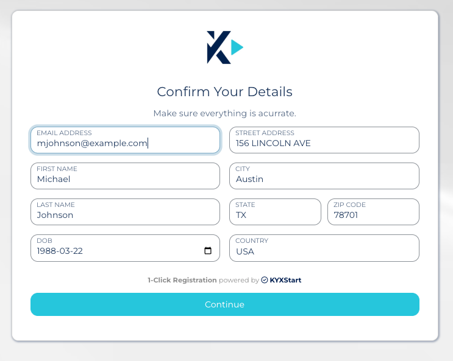</a> 
      <b>KYXStart Registration Prefill</b>
    </td>
    <td align="center" width="33%">
      <a href="./images/05-dashboard-landing.png">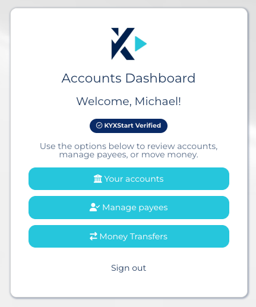</a> 
      <b>Dashboard Landing</b>
    </td>
    <td align="center" width="33%">
      <a href="./images/06-add-account.png">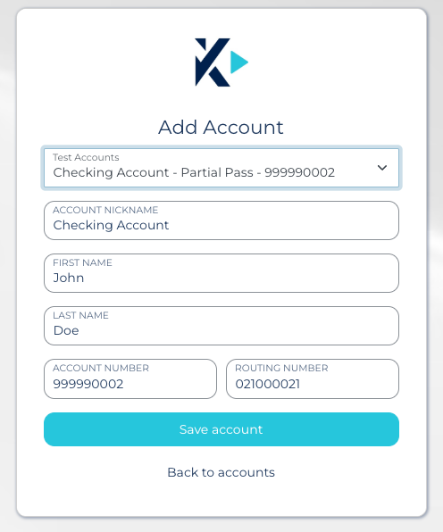</a> 
      <b>Add Account</b>
    </td>
  </tr>
  <tr>
    <td align="center" width="33%">
      <a href="./images/07-add-account-verification.png">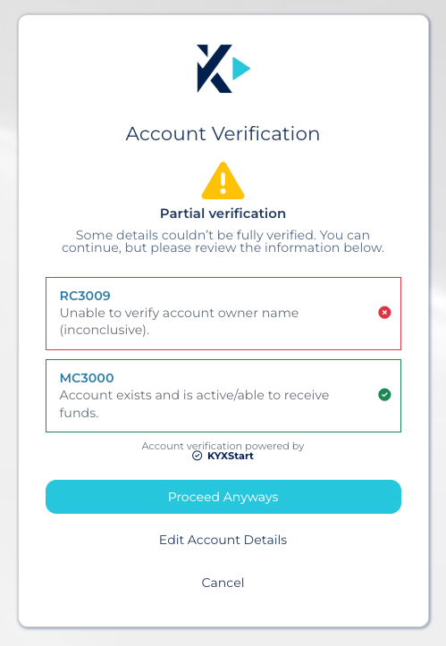</a> 
      <b>Add Account Verification</b>
    </td>
    <td align="center" width="33%">
      <a href="./images/08-failed-account-verification.png">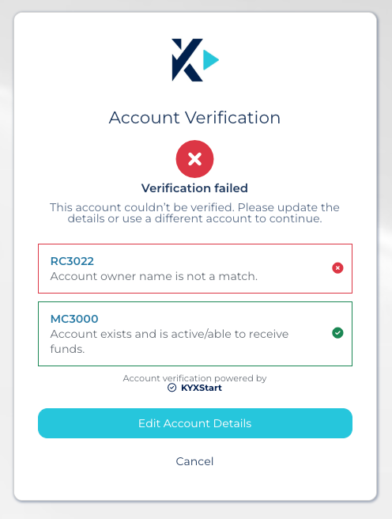</a> 
      <b>Failed Verification</b>
    </td>
    <td align="center" width="33%">
      <a href="./images/09-view-account.png">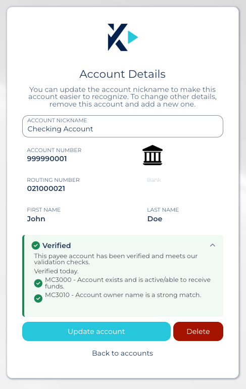</a> 
      <b>View Account</b>
    </td>
  </tr>
  <tr>
    <td align="center" width="33%">
      <a href="./images/10-new-transfer.png">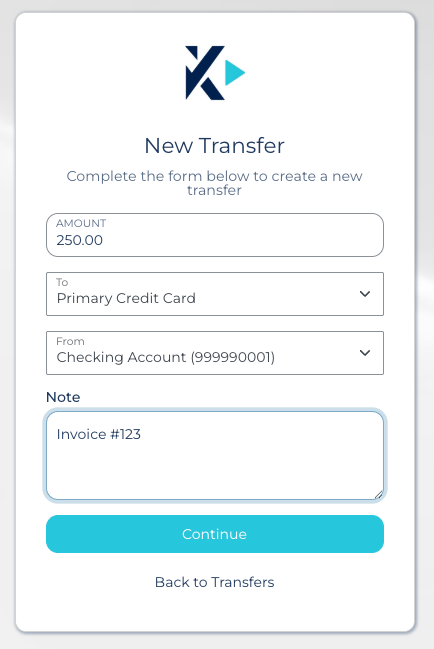</a> 
      <b>New Transfer</b>
    </td>
    <td align="center" width="33%">
      <a href="./images/11-transfer-confirmation.png">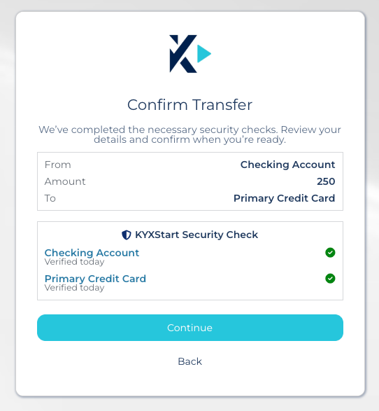</a> 
      <b>Transfer Confirmation</b>
    </td>
    <td align="center" width="33%">
      <a href="./images/12-view-transfer.png">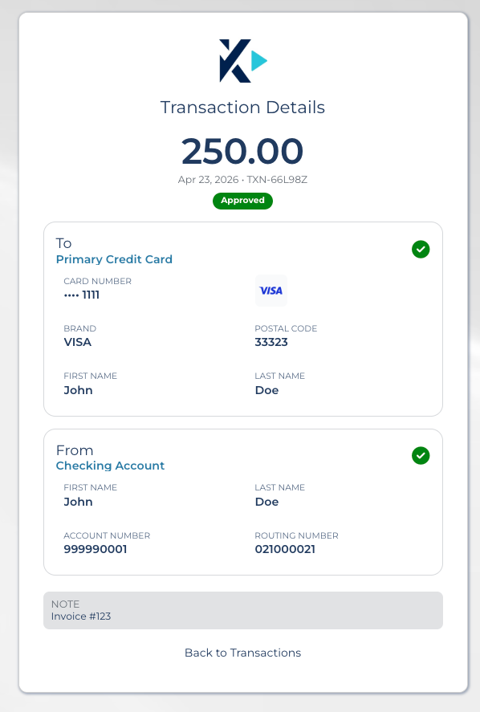</a> 
      <b>View Transfer</b>
    </td>
  </tr>
</table>

## Live Demo

The following links launch the live demo environment hosted in PingOne DaVinci. All themes provide the same experience — only the branding differs.

> **Note:** Live demo availability is not guaranteed. The environment may be unavailable or reset without notice.

| Brand Theme | Demo Link |
|---|---|
| KYXStart | [Launch KYXStart Demo](https://auth.pingone.com/af8a50b1-d359-40bf-8a6f-86181d98f57d/davinci/policy/73c9c3fd7df5dc772d817e27bbd27fbf/authorize?client_id=6aa3c8d87439e5c660364122addf15b8&response_type=code&scope=openid&redirect_uri=https://auth.pingone.com/af8a50b1-d359-40bf-8a6f-86181d98f57d/davinci/testrp) |
| Experian | [Launch Experian Demo](https://auth.pingone.com/af8a50b1-d359-40bf-8a6f-86181d98f57d/davinci/policy/c17e09240a2b76d4d1b51bb2391b013a/authorize?client_id=6aa3c8d87439e5c660364122addf15b8&response_type=code&scope=openid&redirect_uri=https://auth.pingone.com/af8a50b1-d359-40bf-8a6f-86181d98f57d/davinci/testrp) |
| MoneyGram | [Launch MoneyGram Demo](https://auth.pingone.com/af8a50b1-d359-40bf-8a6f-86181d98f57d/davinci/policy/90783591416d3c111d1400f806073ccf/authorize?client_id=6aa3c8d87439e5c660364122addf15b8&response_type=code&scope=openid&redirect_uri=https://auth.pingone.com/af8a50b1-d359-40bf-8a6f-86181d98f57d/davinci/testrp) |
| PayPal | [Launch PayPal Demo](https://auth.pingone.com/af8a50b1-d359-40bf-8a6f-86181d98f57d/davinci/policy/9b5c1428109952e69eb5bcb0c99b22a3/authorize?client_id=6aa3c8d87439e5c660364122addf15b8&response_type=code&scope=openid&redirect_uri=https://auth.pingone.com/af8a50b1-d359-40bf-8a6f-86181d98f57d/davinci/testrp) |
| Western Union | [Launch Western Union Demo](https://auth.pingone.com/af8a50b1-d359-40bf-8a6f-86181d98f57d/davinci/policy/552fffe16a9b61f8d86e84dcadc0e019/authorize?client_id=6aa3c8d87439e5c660364122addf15b8&response_type=code&scope=openid&redirect_uri=https://auth.pingone.com/af8a50b1-d359-40bf-8a6f-86181d98f57d/davinci/testrp) |

### Utility

| | |
|---|---|
| Delete KYXStart Demo User | [Launch Delete User Flow](https://auth.pingone.com/af8a50b1-d359-40bf-8a6f-86181d98f57d/davinci/policy/c9b988984a489b19cf242b759a81e864/authorize?client_id=dfd614a0ea8b5945b8caafeff45f4cb2&response_type=code&scope=openid&redirect_uri=https://auth.pingone.com/af8a50b1-d359-40bf-8a6f-86181d98f57d/davinci/testrp) |

## PingOne Configuration Requirements

To replicate this proof of concept in another PingOne tenant, a baseline PingOne configuration is required in addition to the DaVinci flows included in this repository.

### Required Services

The target tenant should have the following services enabled:

- **PingOne**
- **PingOne DaVinci**
- **PingOne MFA**
- **PingOne Verify** *(optional, only required if government document verification is enabled in the flow)*

### Custom User Attributes

The following custom user attributes are used by the solution and should be created in the target PingOne environment:

- **dob**  
  Stores the user’s date of birth.  
  Type: `string`

- **userPayees**  
  Stores payee account data associated with the user.  
  Type: `JSON`

- **userAccounts**  
  Stores financial account data associated with the user.  
  Type: `JSON`

- **verificationLevel**  
  Stores the user’s verification source or level.  
  Type: `string`  
  Expected values include:
  - `KYXSTART`
  - `PINGONE` *(used when government document verification is completed through PingOne Verify)*

- **verifiedDocumentData**  
  Stores persisted government ID verification data when document verification is used.  
  Type: `JSON`

## Solution Customization

Several aspects of the solution can be customized directly within the outermost DaVinci flow. These settings are defined in the first node, **Create Config Object**, and allow the demo to be adapted for different environments and use cases.

### Configuration Properties

- **companyName**  
  Defines the company name displayed throughout the solution.

- **companyLogo**  
  Specifies the logo shown on solution forms and screens.

- **enableRegistrationTestMode**  
  Controls whether registration uses KYXStart test data or performs a live phone number lookup.  
  This is set to `true` in the demo because KYXStart can verify against real phone numbers, and test mode provides sample users for registration scenarios.  
  When set to `false`, the phone number entered during registration is verified using a live lookup.

- **requiredVerificationLevel**  
  Determines whether additional user verification is required after registration, once the user reaches the main dashboard.  
  Supported values include:
  - `PINGONE` — enforces a government document verification step using PingOne Verify
  - `KYXSTART` — treats the verification completed during registration as sufficient

- **enableTestAccounts**  
  Controls whether users can select from sample bank accounts and credit cards during account onboarding.  
  Because this solution is a proof of concept, this is typically set to `true` to make it easier to demonstrate different verification outcomes, including pass, partial, and fail scenarios.

- **accountVerificationTTLDays**  
  Defines how long an account verification result remains valid before the account must be reverified during a transfer.  
  The pre-verification step compares the current date to the account’s last verification date.  
  When set to `0`, the account is reverified for every transfer.
  
### Additional Notes

- **Demo registration users**  
  Additional demo users can be supported for registration scenarios, provided they have been configured in KYXStart. To add or modify these users, open the **KYXStart SignOn/Register** flow and review the second node, **`Populate Sample Users`**, which contains the current list of sample users.

- **Test bank and credit card accounts**  
  Test financial accounts used by the demo can also be updated. To modify the sample bank or credit card accounts, open the **KYXStart Dashboard** flow and use search to locate the **`Populate Test Accounts`** node. This is the first node within the **Add Account** teleport.

## DaVinci Flow Exports

The following DaVinci flow exports are included in this repository. All flows provide the same experience and functionality — the only difference between them is the applied brand theme.

| Brand Theme | Export File |
|---|---|
| Experian | [Experian Branding Export](./flows/Experian_Branding_Export_2026-04-24.json) |
| MoneyGram | [MoneyGram Branding Export](./flows/Moneygram_Branding_Export_2026-04-24.json) |
| PayPal | [PayPal Branding Export](./flows/Paypal_Branding_Export_2026-04-24.json) |
| Western Union | [Western Union Branding Export](./flows/Western_Union_Branding_Export_2026-04-24.json) |
| KYXStart | [KYXStart Branding Export](./flows/KYXStart_Branding_Export_2026-04-24.json) |

### Utility Flows

| Flow | Export File | Description |
|---|---|---|
| Delete KYXStart Demo User | [Delete PingOne KYXStart User](./flows/Delete_PingOne_KYXStart_User_Export_2026-04-24.json) | Removes a test user from PingOne so the demo can be restarted with a fresh registration. |

